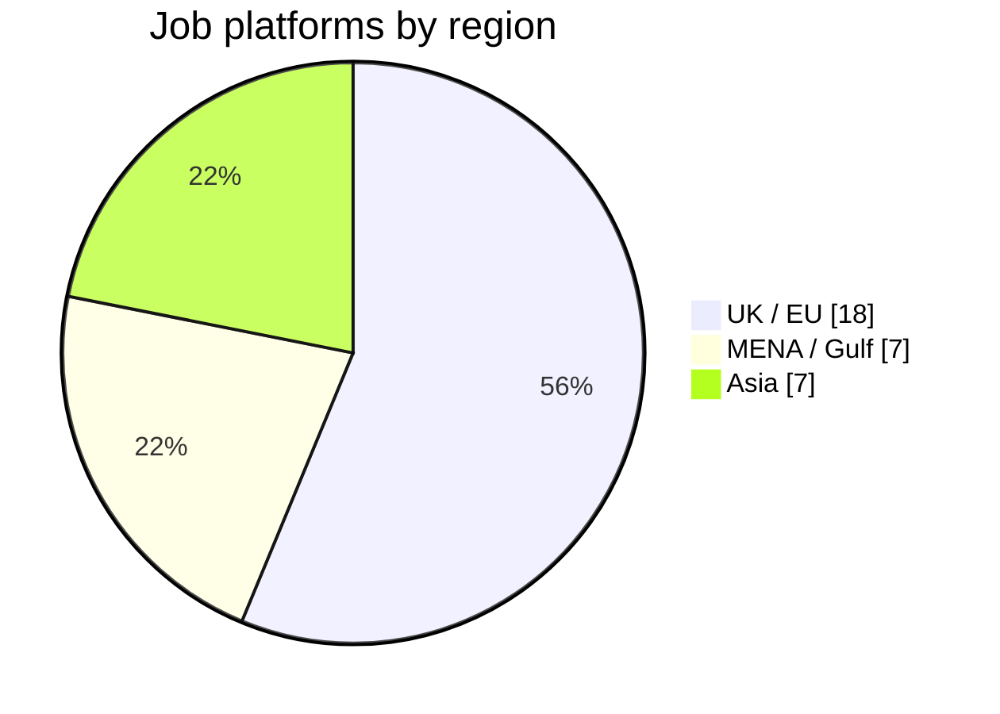
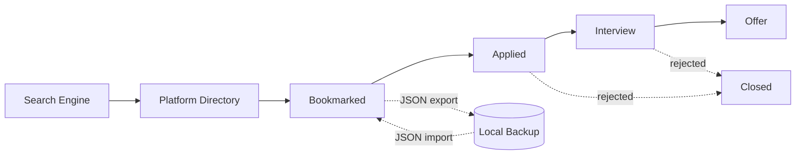

<div align="center">

# 🎯 Job Search HQ

### A zero-dependency, single-file job search command center

*Built for senior professionals targeting multi-region markets simultaneously.*

<br>


[](https://htmlpreview.github.io/?https://github.com/AIMLDS7/JobSearch_HQ/blob/main/DG_JobSearch_HQ_v5.0.html)


<br>


</div>

---

## 📖 Table of Contents

- [Why it exists](#-why-it-exists)
- [By the numbers](#-by-the-numbers)
- [Features](#-features)
- [How the data flows](#-how-the-data-flows)
- [Quick start](#-quick-start)
- [Keyboard shortcuts](#-keyboard-shortcuts)
- [Customisation](#-customisation)
- [Architecture decision](#-architecture-decision)
- [Tech stack](#-tech-stack)
- [Target profile](#-target-profile)
- [License](#-license)

---

## 💡 Why it exists

Most job searches are chaotic — a dozen browser tabs, lost bookmarks, and no sense of where you applied or when. **Job Search HQ** replaces that chaos with a structured command center, purpose-built for senior roles across **MENA, UK, and EU** markets.

Open one HTML file. Everything runs locally in your browser. **No server, no login, no subscription.**

▶ **[Launch the live app](https://htmlpreview.github.io/?https://github.com/AIMLDS7/JobSearch_HQ/blob/main/DG_JobSearch_HQ_v5.0.html)** — or open [`DG_JobSearch_HQ_v5.0.html`](DG_JobSearch_HQ_v5.0.html) directly.

---

## 📊 By the numbers


### Platform directory by region



> *Charts render natively on GitHub via Mermaid — no images, no external services. Adjust the numbers above to match your live directory.*

---

## ⚡ Features

| | Module | What it does |
|---|---|---|
| 🔍 | **Search Engine** | Boolean query builder generating `short` and `full boolean` strings; filters for date, type, seniority, and sector; one-click launch across 32 platforms |
| 🌐 | **Platform Directory** | 32 pre-configured job boards with Smart Search (pre-filled query) and Base Portal links — MENA, UK/EU, and Asia — plus an English-first filter mode |
| 🏢 | **Company Intelligence** | 32+ target companies with region/sector tags, careers links, and LinkedIn shortcuts; fully editable in-browser |
| 📋 | **Application Tracker** | Kanban pipeline (Bookmarked → Applied → Interview → Offer → Rejected) with sorting, filtering, and JSON export/import |
| 🏛️ | **Government Portals** | 14 official government portals across EU, Asia, Gulf, and visa-specific boards, with English availability flagged |
| 🤝 | **Recruiter CRM** | Track recruiters by agency, region, and specialisation with Active / Warm / Cold status tags |
| 🎯 | **ATS Matcher** | Paste a job description; score your CV against it and surface missing keywords before you submit |
| 💬 | **Interview Prep** | Role-specific question banks for Cost Manager, Commercial Manager, Procurement, and Renewable Energy roles |
| ⏰ | **Timing Intelligence** | Live widget showing optimal application time based on recruiter working hours across target time zones |

---

## 🔄 How the data flows

The application tracker models a real recruitment funnel — every entry moves through a defined pipeline:



---

## 🚀 Quick start

No installation. No build step. Just open the file:

```bash
open DG_JobSearch_HQ_v5.0.html
```

> Works in any modern browser, fully offline. Nothing persists without an explicit **Export**.

---

## ⌨️ Keyboard shortcuts

| Key | Action |
|:---:|--------|
| `1` – `8` | Switch tabs |
| `S` | Toggle sidebar |
| `E` | Open edit mode |

---

## 🛠️ Customisation

Everything is editable directly in the browser via **Edit Mode** (`E`):

- Add / remove target locations
- Add / remove role categories
- Edit the company list
- Edit job listings
- Modify the profile chips shown in the header

Hit **Export** to save your changes as a new `.html` file.

---

## 🧱 Architecture decision

This is a **deliberate single-file architecture** — UI, state, logic, and data all live in one `.html` file.

- ✅ **Zero build tooling** — no Webpack, no Node, no `npm install`
- ✅ **Zero dependencies** — only two Google Fonts and Tabler Icons (CDN, optional)
- ✅ **Instant portability** — email it, drop it on a USB stick, open it offline
- ✅ **Stateless by design** — nothing persists without an explicit Export

For a personal productivity tool with a single user, this is the correct tradeoff. A React + backend stack would add complexity without adding value.

---

## 🧰 Tech stack

| Layer | Choice |
|-------|--------|
| Structure | Semantic HTML5 |
| Styling | CSS custom properties, CSS Grid — no framework |
| Logic | Vanilla ES6+ JavaScript |
| Icons | [Tabler Icons](https://tabler.io/icons) (CDN) |
| Fonts | Syne, DM Sans, DM Mono (Google Fonts CDN) |
| Build | None |
| Dependencies | **0** |

---

## 👤 Target profile

Built around a senior profile in **EPC / Energy / Infrastructure**:

- **Roles** — Senior Cost Manager · Quantity Surveyor · Commercial Manager · Procurement Manager
- **Sectors** — EPC/EPCC · BESS / Renewable Energy · Infrastructure
- **Markets** — UAE · KSA · Qatar · UK · Netherlands · Ireland · Norway
- **Experience** — 7+ years (Samsung C&T / Gleeds / TCE)

The role categories, company list, and platform selection reflect this context — but the tool is fully generic and reusable for any senior job search with different targets.

---

## 📄 License

**MIT** — fork it, adapt it, make it your own.

<div align="center">
<br>

*Built by [Darsh](https://github.com/AIMLDS7) · Growth is a life.*

</div>
